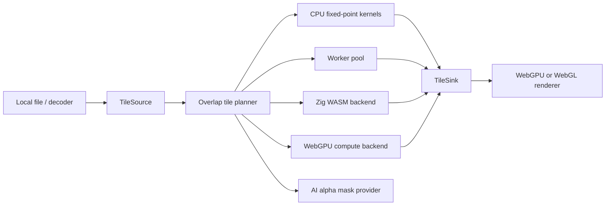

# phantom

[](https://github.com/ParamissionLab/phantom/actions/workflows/ci.yml)
[](LICENSE)

Maintained by [Paramission Lab](https://github.com/ParamissionLab).

Tile-first RGBA image processing for large browser and Node.js workloads. The SDK combines a deterministic CPU baseline with worker, WebGPU, Zig WebAssembly, and optional AI background-removal paths.

> **Release status:** `0.1.x` is an initial public release. Pin the minor version until the API reaches `1.0.0`.

## Installation

From the npm registry:

```bash
npm install @paramissionlab/phantom
```

The unscoped `phantom` package name is already used on npm, so the public npm
package is scoped under Paramission Lab while the SDK brand and API remain
Phantom.

Directly from a public GitHub repository:

```bash
npm install git+https://github.com/ParamissionLab/phantom.git#v0.1.0
```

For a private organization repository configured with SSH access:

```bash
npm install git+ssh://git@github.com/ParamissionLab/phantom.git#v0.1.0
```

Use a release tag or full commit SHA instead of `main` so installs remain reproducible. npm installs development dependencies and runs the package `prepare` script to compile TypeScript when installing from Git. The optional Zig WASM binary is not compiled during Git installation; build it explicitly with Zig when that backend is required.

The AI runtime is an optional dependency and is initialized only when `@paramissionlab/phantom/ai` is used. Model weights are not included in the npm package.

## Features

- Fixed-capacity stream ingestion through `FixedByteRingBuffer`.
- Overlap-aware tiling for convolution filters without tile-edge artifacts.
- Fixed-point RGBA kernels: identity, invert, grayscale, smooth enhance, and sharpen 3x3.
- Discoverable filter profiles with overlap and backend metadata.
- Fuzzy edge-connected background removal for plain or product backdrops.
- Optional browser AI background removal for people, animals, and complex scenes.
- Provider-neutral alpha-mask refinement with color-guided soft edges.
- Raw RGBA source/sink abstraction for decoder-specific integrations.
- Browser worker pool and transferable tile payloads.
- SharedArrayBuffer tile memory helper for isolated worker runtimes.
- WebGPU compute backend plus WebGPU/WebGL texture upload adapters.
- Zig `wasm32-freestanding` kernel source and TypeScript WASM adapter.
- Branded `PhantomError` for SDK validation and backend failures.
- TypeScript strict mode, Vitest tests, ESLint, Prettier, and CI.

## Quick Start

```ts
import {
  PhantomError,
  processRawImage,
  type RawRgbaImage,
} from "@paramissionlab/phantom";

const input: RawRgbaImage = {
  width: 2,
  height: 1,
  data: Uint8Array.from([10, 20, 30, 255, 200, 210, 220, 255]),
};

try {
  const output = await processRawImage(input, {
    tileSize: 512,
    overlap: 1,
    filter: "sharpen3x3",
  });
} catch (error) {
  if (error instanceof PhantomError) {
    // Handle SDK validation or backend errors.
  }
}
```

## Package Entry Points

| Import                            | Purpose                                                        |
| --------------------------------- | -------------------------------------------------------------- |
| `@paramissionlab/phantom`         | Core tiling, filters, masks, pipeline, planning, and utilities |
| `@paramissionlab/phantom/ai`      | Lazy AI subject-mask generation                                |
| `@paramissionlab/phantom/gpu`     | WebGPU compute and WebGPU/WebGL renderers                      |
| `@paramissionlab/phantom/wasm`    | Zig WebAssembly loader and accelerated kernel adapter          |
| `@paramissionlab/phantom/workers` | Worker pool and shared tile-buffer helpers                     |

Remove a mostly-uniform background and keep alpha for PNG export:

```ts
import { removeBackground } from "@paramissionlab/phantom";

const cutout = removeBackground(input, {
  threshold: 38,
  softness: 44,
  featherRadius: 2,
});
```

Apply a mask from any segmentation provider:

```ts
import { applyAlphaMask } from "@paramissionlab/phantom";

const cutout = applyAlphaMask(input, {
  width: maskWidth,
  height: maskHeight,
  data: maskBytes,
});
```

## AI Background Removal

The optional browser entry point is part of the SDK. It lazily loads the model,
uses WebGPU when available, falls back to quantized WASM, and reuses the loaded
pipeline across images.

```ts
import { applyAlphaMask } from "@paramissionlab/phantom";
import { createPhantomAi } from "@paramissionlab/phantom/ai";

const phantom = createPhantomAi();
await phantom.preload();
const { mask, backend } = await phantom.createMask(imageCanvas, (progress) => {
  console.log(progress.label, progress.percent ?? "");
});
const cutout = applyAlphaMask(input, mask, {
  featherRadius: 2,
  edgeSensitivity: 58,
});

console.log(backend); // webgpu or wasm
await phantom.dispose();
```

Start model initialization while decoding an image:

```ts
const modelReady = phantom.preload(onModelProgress);
const bitmapReady = createImageBitmap(file);
const [, bitmap] = await Promise.all([modelReady, bitmapReady]);

canvasContext.drawImage(bitmap, 0, 0);
const result = await phantom.createMask(canvas);
bitmap.close();
```

All concurrent `preload()` and `createMask()` calls on the same instance share one model initialization promise. `createAiBackgroundRemover()` remains available as the descriptive alias.

Configuration:

| Option        | Default                     | Description                                 |
| ------------- | --------------------------- | ------------------------------------------- |
| `model`       | `onnx-community/ormbg-ONNX` | Transformers.js-compatible background model |
| `backend`     | `auto`                      | `auto`, `webgpu`, or CPU/WASM fallback      |
| `webgpuDtype` | `fp16`                      | WebGPU precision: `fp16` or `fp32`          |
| `wasmDtype`   | `q8`                        | Fallback precision: `q4`, `q8`, or `fp32`   |

The default `onnx-community/ormbg-ONNX` model is Apache-2.0 licensed. Model
weights are downloaded on first AI use and cached by the runtime; importing the
core package does not initialize the AI runtime. Review the model license before
selecting another model. For offline deployments, configure Transformers.js to
use self-hosted model files before creating the remover.

## Architecture

The core does not depend on DOM APIs:



Compressed image streaming is intentionally kept outside the core. Integrate a decoder by implementing `TileSource.read(rect)` and `TileSink.write(rect, data)`. This keeps memory bounded and avoids coupling the pipeline to one image codec.

## Scripts

| Command              | Purpose                                                           |
| -------------------- | ----------------------------------------------------------------- |
| `npm test`           | Run unit and integration tests.                                   |
| `npm run dev`        | Run the separated demo app from `demo/` locally.                  |
| `npm run demo:build` | Build the separated demo app into `demo-dist/`.                   |
| `npm run typecheck`  | Run TypeScript strict checks.                                     |
| `npm run lint`       | Run ESLint.                                                       |
| `npm run build`      | Emit TypeScript build artifacts to `dist/`.                       |
| `npm run prepare`    | Build TypeScript for direct Git dependency installation.          |
| `npm run build:wasm` | Compile `zig/src/kernel.zig` to `dist/phantom_kernel.wasm`.       |
| `npm run ci`         | Run typecheck, lint, tests, TypeScript build, and Zig WASM build. |
| `npm run release:*`  | Bump package version with npm, for example `release:patch`.       |

## Development

Node.js 22 and Zig 0.15.2 match the GitHub Actions environment.

```bash
npm ci
npm run ci
npm run demo:build
npm run dev
```

See [CONTRIBUTING.md](CONTRIBUTING.md) for pull-request requirements and [SECURITY.md](SECURITY.md) for private vulnerability reporting.

## npm Release

The repository includes CI/CD for publishing the SDK to
[npmjs.com](https://www.npmjs.com/). Configure these GitHub organization or
repository settings before the first release:

1. Create an npm automation token with publish access.
2. Add it to GitHub Actions secrets as `NPM_TOKEN`.
3. Create a GitHub Environment named `npm` and require reviewer approval if the
   package should not publish automatically.
4. Confirm the npm organization scope `@paramissionlab` exists and that the
   `NPM_TOKEN` account has publish access to it.

First release flow for the current `0.1.0` package:

```bash
git tag v0.1.0
git push origin main --tags
```

Future patch release flow:

```bash
npm run release:patch
git push origin main --follow-tags
```

Pushing a `v*.*.*` tag starts the `Publish npm` workflow. The workflow checks
out that tag, runs `npm run ci`, builds the demo, validates the tarball with
`npm pack --dry-run`, and publishes with npm provenance.

You can still create a GitHub Release for the same tag after the tag is pushed.
Publishing a GitHub Release also starts the same workflow, protected by the
`npm` environment.

Manual publish from GitHub Actions is also available through the `Publish npm`
workflow dispatch input. Use a release tag such as `v0.1.0` when possible.

## Zig WASM Backend

Build the kernel:

```bash
npm run build
npm run build:wasm
```

Instantiate it in the browser or another WebAssembly host:

```ts
import { instantiateZigBackend } from "@paramissionlab/phantom/wasm";

const bytes = await fetch("/phantom_kernel.wasm").then((response) =>
  response.arrayBuffer(),
);
const backend = await instantiateZigBackend(bytes);
const output = backend.process(input, "grayscale");
```

## Browser Capability Selection

```ts
import { detectCapabilities } from "@paramissionlab/phantom/gpu";

const capabilities = detectCapabilities();
```

`detectCapabilities()` returns `webgpu`, `wasm-simd`, or `cpu` as the preferred backend. WASM threads require `SharedArrayBuffer` and cross-origin isolation headers.

## Development Notes

- The default CPU path is the correctness baseline.
- AI inference should run on a bounded working image. Refine and apply its alpha
  mask tile-by-tile for 32K/64K outputs instead of allocating a full-resolution
  neural-network tensor.
- `tileSize` and `overlap` are explicit knobs; convolution filters should use an overlap at least equal to the kernel radius.
- WebGPU compute kernels are not hardcoded into the core. Add them behind the same `TileSource` and `TileSink` contracts.
- Memory64 is tracked as an exploration item because browser support remains environment-dependent.

## Operational Limits

- A 32K/64K target is processed as bounded tiles; it is not a promise that every browser or decoder can allocate a complete frame.
- AI quality depends on the selected model and input. Keep the deterministic fuzzy path available for plain backdrops.
- WebGPU availability and supported precision vary by browser and GPU driver. The SDK falls back when initialization fails.
- `SharedArrayBuffer` requires cross-origin isolation headers.

## Project Documents

- [Changelog](CHANGELOG.md)
- [Contributing](CONTRIBUTING.md)
- [Security policy](SECURITY.md)
- [MIT license](LICENSE)

## License

[MIT](LICENSE)
